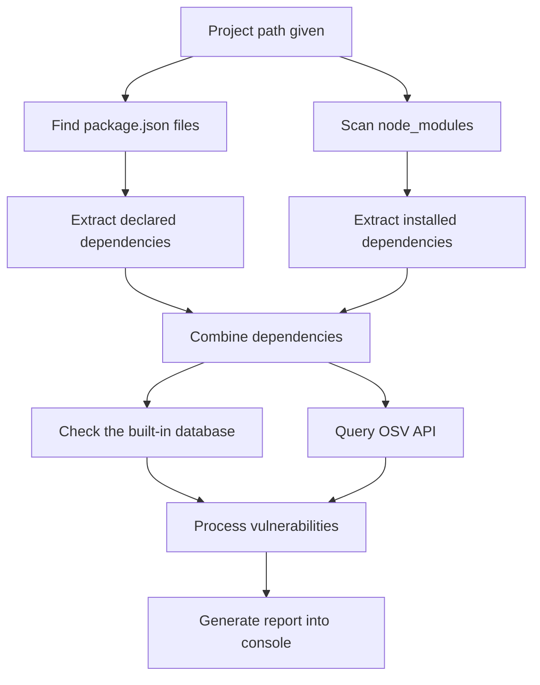

```mermaid
graph TD
    A[Project path given] --> B[Find package.json files]
    A --> C[Scan node_modules]
    B --> D[Extract declared dependencies]
    C --> E[Extract installed dependencies]
    D & E --> F[Combine dependencies]
    F --> G[Check the built-in database]
    F --> H[Query OSV API]
    G & H --> I[Process vulnerabilities]
    I --> J[Generate report into console]
```