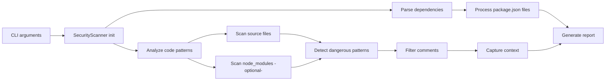

```mermaid
graph LR
    A[CLI arguments] --> B[SecurityScanner init]
    B --> C[Parse dependencies]
    B --> D[Analyze code patterns]
    C --> E[Process package.json files]
    D --> F[Scan source files]
    D --> G[Scan node_modules -optional-]
    F & G --> H[Detect dangerous patterns]
    H --> I[Filter comments]
    I --> J[Capture context]
    E & J --> K[Generate report]
```